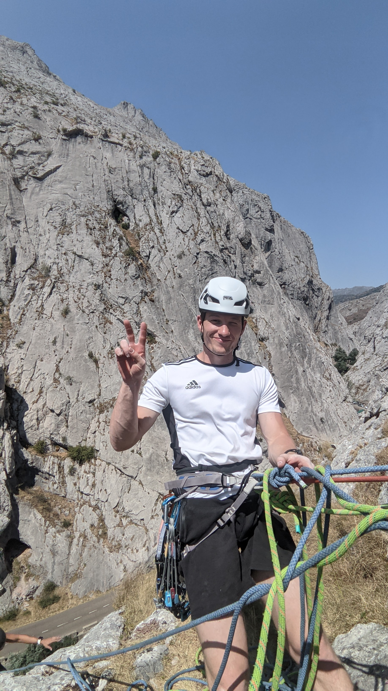

  
  

    
  

  

    <h1 style="margin-top: 0;">¡Hola! Soy Fabio.</h1>
    <h3 style="color: #666; font-weight: normal;">Ingeniero Mecánico | UVigo</h3>
    

      Soy un estudiante de ingeniería apasionado por conectar el mundo digital con el físico.
      Me especializo en <strong>Diseño Mecánico</strong> y <strong>Mecatrónica</strong>, llevando proyectos desde el modelo CAD hasta el prototipo funcional que puedes tocar.
    

     
    <a href="mailto:fabio11fcv@gmail.com" style="background-color: #333; color: white; padding: 10px 20px; text-decoration: none; border-radius: 5px;">Contactar</a>
    <a href="./proyectos/" style="border: 1px solid #333; color: #333; padding: 10px 20px; text-decoration: none; border-radius: 5px; margin-left: 10px;">Ver Portafolio</a>
  

<h2 style="text-align: center; margin-bottom: 30px;">Habilidades Técnicas</h2>

  
  

    <h4>🛠️ Diseño Mecánico</h4>
    
SolidWorks (CSWA/P), Catia V5, Diseño de mecanismos, Selección de materiales, GD&T.

  

  

    <h4>⚡ Electrónica</h4>
    
Arduino, Control de Motores BLDC, Sensores, Soldadura de PCB, Instrumentación básica.

  

  

    <h4>🏭 Fabricación</h4>
    
Impresión 3D (FDM), Torno y Fresadora manual, Mecanizado CNC, Herramientas de taller.

  

  

<h3>⭐ Proyecto Destacado</h3>

    <h2 style="color: white; text-shadow: 0 2px 4px rgba(0,0,0,0.5); margin-bottom: 15px; font-size: 2.2em; border: none;">
        🏎️ Simulador Direct Drive Híbrido
    </h2>
    
    

        Ingeniería Open Source llevada al límite: Motor de 15Nm recuperado, electrónica personalizada y pedales con célula de carga.
    

    <a href="./simulador-racing" style="
        background-color: #2ea44f;
        color: white;
        padding: 15px 30px;
        text-decoration: none;
        border-radius: 6px;
        font-weight: bold;
        font-size: 18px;
        border: 1px solid rgba(255, 255, 255, 0.2);
        box-shadow: 0 4px 6px rgba(0,0,0,0.2);">
        VER CASO DE ESTUDIO ➔
    </a>

