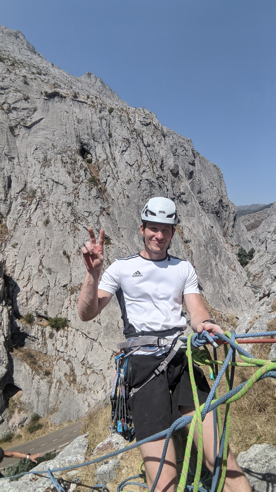

  🇪🇸 ES
  <a href="/en/" style="text-decoration: none; padding: 5px 12px; border-radius: 4px; font-weight: bold; border: 1px solid #24292e; color: #24292e; font-size: 0.9em; transition: all 0.2s;">🇬🇧 EN</a>

  
  

    
  

  

    Ingeniería Mecánica
    <h1 style="margin-top: 15px; margin-bottom: 10px; font-size: 2.8rem; line-height: 1.1;">Hola, soy Fabio Campos.</h1>
    <h3 style="color: #555; font-weight: normal; margin-top: 0; font-size: 1.3rem;">Estudiante de Último Año | Universidad de Vigo</h3>
    
    

      Especializado en <strong>Diseño de Máquinas</strong> y <strong>Fabricación</strong>. 
      Mi enfoque combina la ingeniería mecánica clásica con la electrónica moderna (IoT/Mecatrónica) para llevar proyectos desde el CAD hasta el prototipo funcional.
    

    

      🎓 Actualmente desarrollando mi TFG sobre estructuras criogénicas para el experimento internacional DUNE.
    

    
     
    
    

      <a href="./proyectos/" style="background-color: #24292e; color: white; padding: 12px 28px; text-decoration: none; border-radius: 6px; font-weight: 600; font-size: 1.05rem; transition: background 0.3s;">Ver Proyectos</a>
      <a href="./resume/" style="background-color: white; color: #24292e; border: 2px solid #24292e; padding: 10px 23px; text-decoration: none; border-radius: 6px; font-weight: 600; font-size: 1.05rem; transition: all 0.3s;">📄 Ver Currículum</a>
    

  

  <h2 style="margin-bottom: 10px; font-size: 2rem;">Competencias Técnicas</h2>
  
Un perfil híbrido entre la mecánica tradicional y la tecnología digital.

  
  

    <h4 style="color: #0366d6; margin-top: 0; font-size: 1.3rem;">📐 Ingeniería & CAD</h4>
    

      Dominio avanzado de <strong>SolidWorks</strong> (Diseño Paramétrico y Chapas metálicas). Experiencia en simulación FEA (ANSYS/SW Simulation) y cálculo de estructuras.
    

  

  

    <h4 style="color: #d63384; margin-top: 0; font-size: 1.3rem;">⚡ Electrónica & IoT</h4>
    

      Integración de microcontroladores (<strong>ESP32/Arduino</strong>) con sensores industriales (Células de carga, Encoders). Programación en C++ y Python para análisis de datos.
    

  

  

    <h4 style="color: #2ea44f; margin-top: 0; font-size: 1.3rem;">🏭 Fabricación Real</h4>
    

      Del ordenador al taller. Experiencia en <strong>Impresión 3D</strong> (Diseño de piezas funcionales), mecanizado CNC básico y montaje estructural en obra.
    

  

   

<h3 style="border-left: 5px solid #0366d6; padding-left: 15px; font-size: 1.5rem;">Proyecto Destacado</h3>

    Mecatrónica Aplicada

    <h2 style="color: white; margin-bottom: 20px; font-size: 2.8em; border: none; text-shadow: 0 2px 10px rgba(0,0,0,0.5);">
        Simulador Direct Drive 15Nm
    </h2>
    
    

        Un sistema de simulación de alto rendimiento construido mediante ingeniería inversa. 
        Reutilización de motores industriales, diseño de pedales hidráulicos con células de carga y telemetría visual programada desde cero.
    

    <a href="./simulador-racing" style="
        background-color: white;
        color: #333;
        padding: 15px 35px;
        text-decoration: none;
        border-radius: 30px;
        font-weight: bold;
        font-size: 18px;
        transition: transform 0.2s;
        display: inline-block;">
        Ver Caso de Estudio ➔
    </a>

    <a href="./proyectos/" style="color: #0366d6; text-decoration: none; font-weight: bold; font-size: 1.2em; border-bottom: 2px solid #0366d6;">Ver todos los proyectos (Cinta Modular, TFG Dune...) ➔</a>

