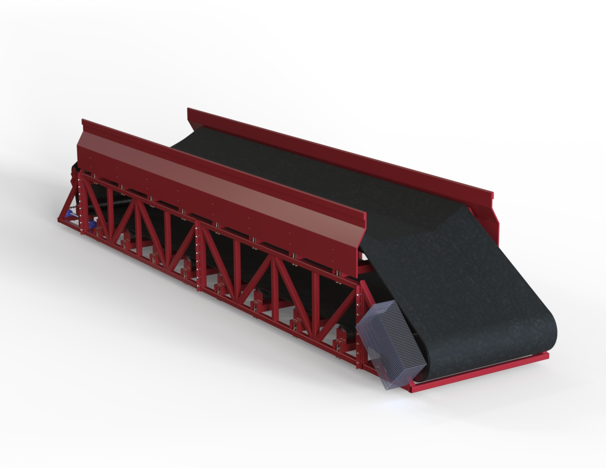
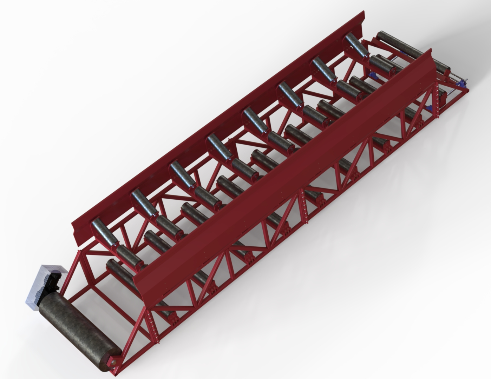
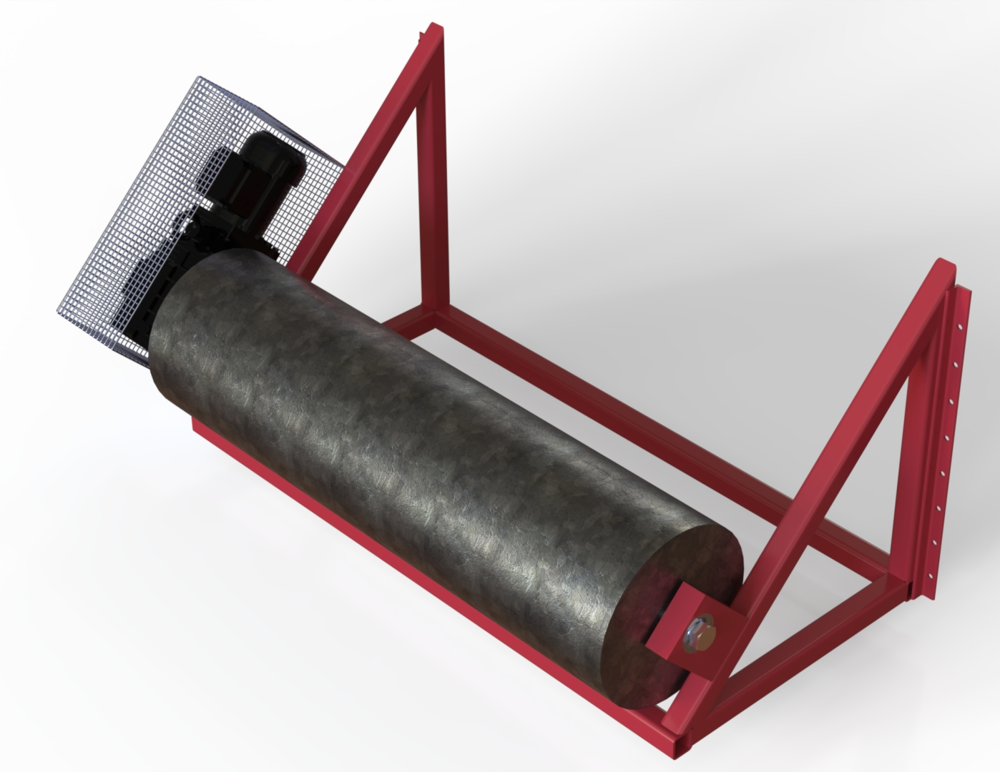
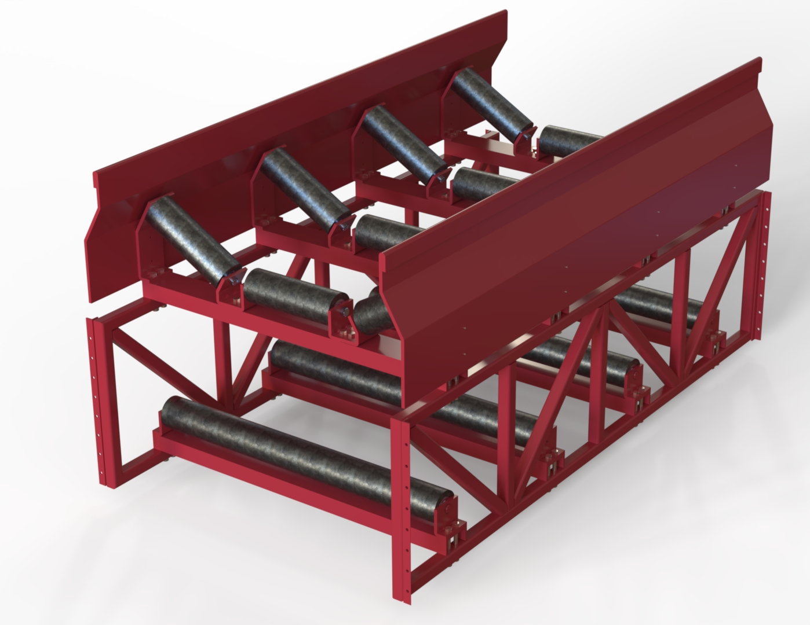
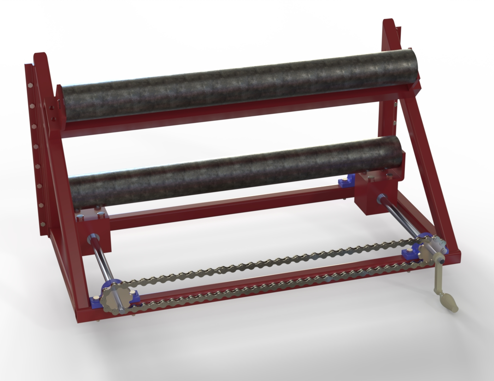

# 🏗️ Cinta Transportadora Modular de Material Granular

 

> **"Estandarización y escalabilidad industrial."**
> Proyecto final para la certificación de **Expertos en SolidWorks (CSWP)** de la Universidad de Vigo. Un sistema de transporte diseñado para adaptarse a diferentes longitudes sin rediseñar la ingeniería base.

---

### ⚙️ El Desafío: Adaptabilidad en Obra

En el procesamiento de áridos, las distancias de transporte cambian según la planta. Diseñar una cinta nueva para cada proyecto es ineficiente y costoso.

El objetivo fue crear un **activo modular**: un "Lego" industrial donde la longitud total es la suma de `N` módulos centrales idénticos.

* **Diseño Paramétrico:** Todo el ensamblaje está vinculado por ecuaciones. Si cambia el ancho de banda, se actualizan automáticamente rodillos, chasis y soportes.
* **Robustez:** Estructura de celosía optimizada para soportar cargas dinámicas con el mínimo peso de acero.

 
 

### 🔌 Módulo A: Cabezal Motriz

Es el corazón del sistema, donde se genera la tracción. Diseñado para ser compacto y seguro.

* **Grupo Motriz:** Motorreductor acoplado directamente al eje para minimizar pérdidas mecánicas.
* **Seguridad:** Incluye protecciones laterales para partes móviles y rodillo tractor recauchutado para maximizar el agarre con la banda (coeficiente de fricción optimizado).
* **Transmisión:** Cálculo de par realizado para mover la banda a plena carga con una pendiente de 20°.

 
 

### 📏 Módulo B: Cuerpo Extensible

Aquí reside la inteligencia del diseño. Este módulo es una unidad repetitiva de longitud estándar (3 metros).

* **Modularidad Infinita:** ¿Necesitas una cinta de 30 metros? Simplemente ensamblas 10 de estos módulos entre el cabezal y la cola.
* **Rodillos en "V":** Disposición de rodillos artesa (troughing idlers) para acunar el material granular y evitar derrames laterales durante el transporte.
* **Fabricación:** Diseñado con perfiles comerciales estándar para facilitar la manufactura y el recambio.

 
 

### 🔧 Módulo C: Sistema Tensor de Cola

El final de la línea cumple una doble función crítica para el mantenimiento.

* **Tensión de Banda:** Sistema mecánico de husillo (tornillo sin fin) que permite tensar la goma cuando esta cede por el uso continuado.
* **Corrección de Tracking:** Permite ajustar independientemente el lado izquierdo y derecho del rodillo para centrar la banda y evitar que roce con la estructura metálica.

 

---

### 🚀 Ficha Técnica del Diseño

| Característica | Especificación | Herramienta |
| :--- | :--- | :--- |
| **Software CAD** | SolidWorks 2024 | Diseño de Ensamblajes |
| **Renderizado** | SolidWorks Visualize | RTX / PBR Materials |
| **Tipo de Banda** | Caucho vulcanizado texturizado | Apariencia: Rubber Tread |
| **Estructura** | Acero Galvanizado / Pintura RAL 3000 | Perfilería Estándar |
| **Contexto** | Univ. de Vigo (Expertos SW) | Proyecto Académico |

---
[🔙 Volver al Portafolio](./)
