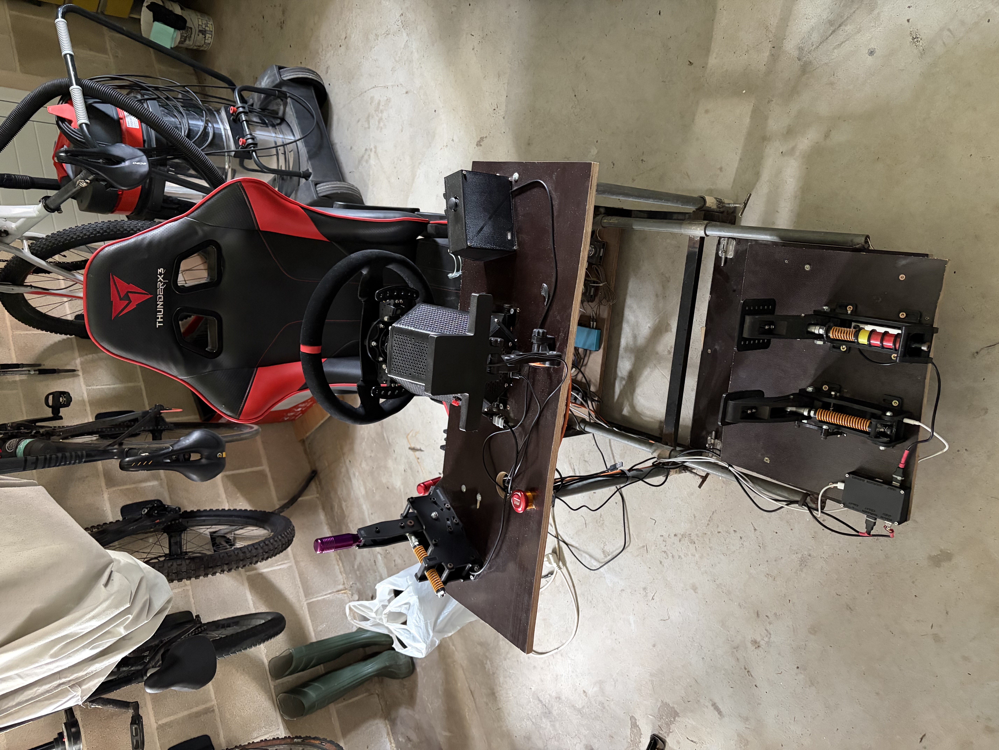
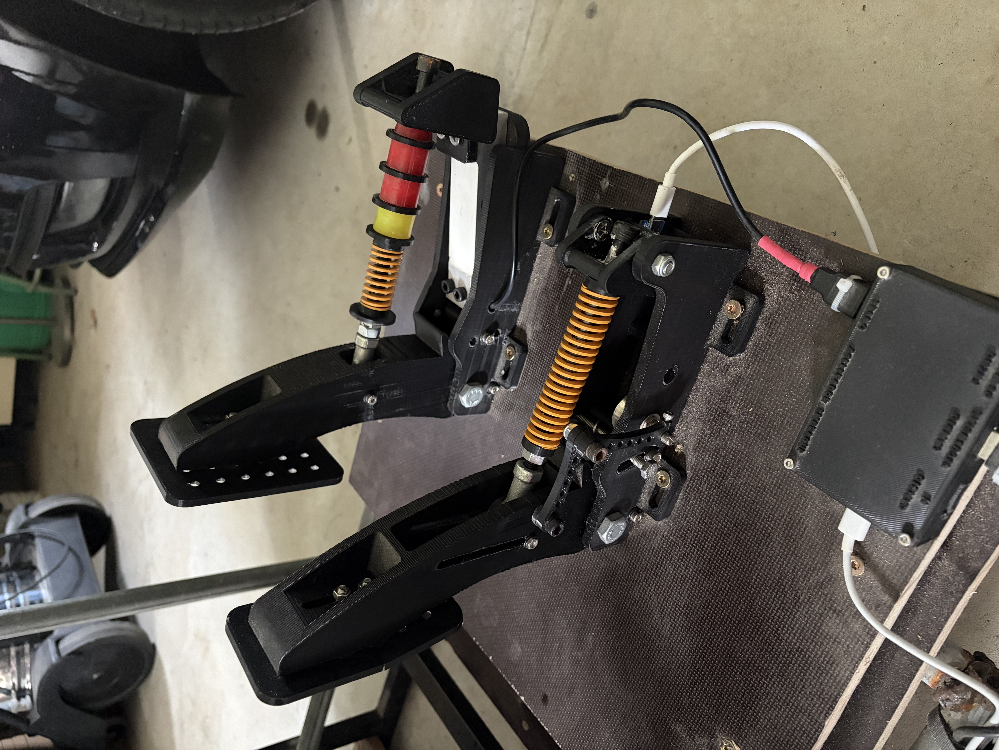
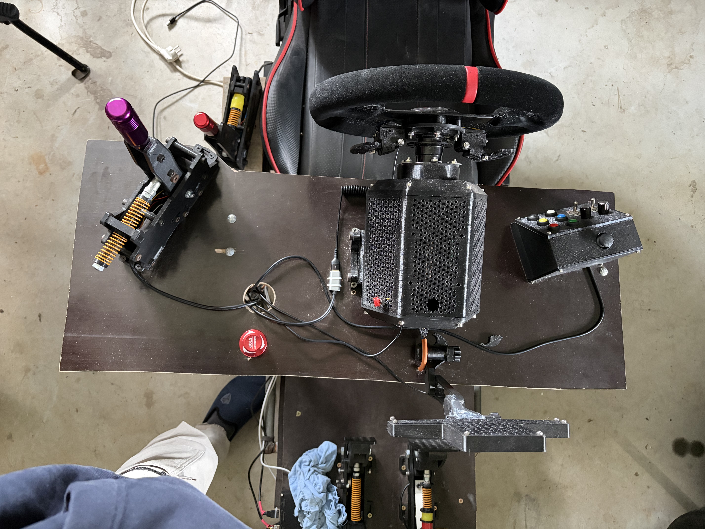
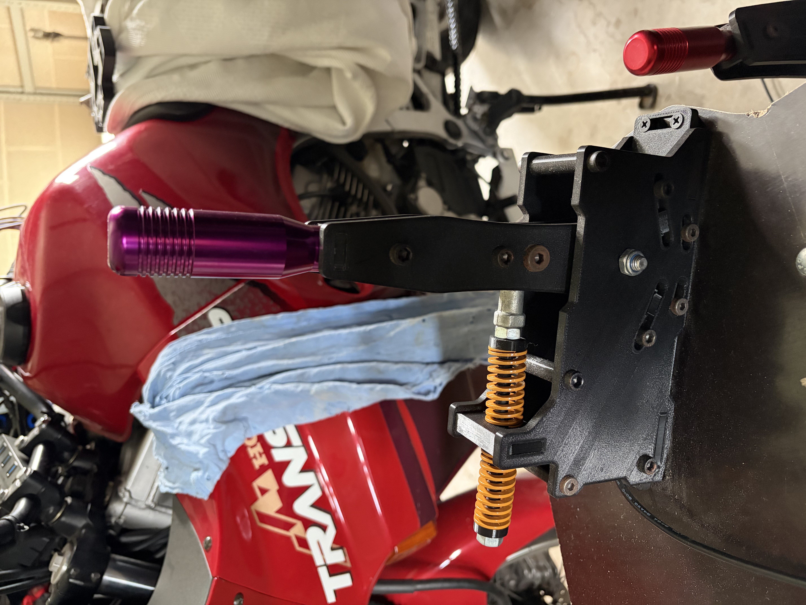
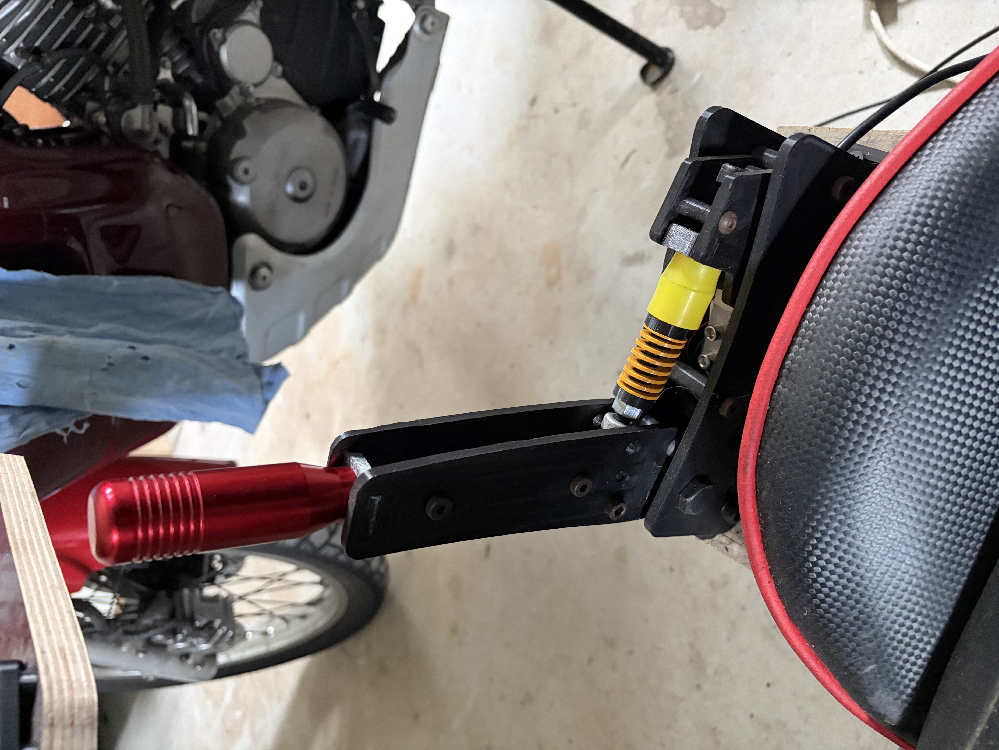
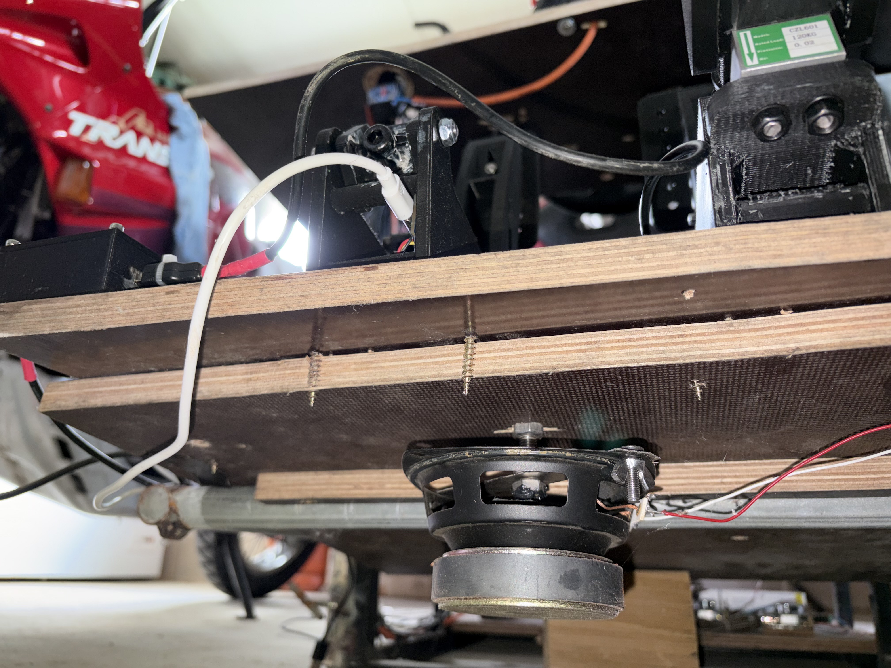

# 🏎️ OpenSource DIY Direct Drive Sim Rig

 

> **"Ingeniería de competición al alcance del maker."**
> Un ecosistema de simulación completo, diseñado desde cero para replicar las fuerzas de un coche real usando el proyecto **FFBeast**, impresión 3D avanzada y telemetría visual.

---

### ⚡ El Corazón: Proyecto FFBeast

Para el Force Feedback, he huido de las soluciones comerciales cerradas. El sistema se basa en el proyecto Open Source **FFBeast**, conocido por su capacidad de gestionar pares de fuerza extremos con una fidelidad increíble.

* **Motor:** Recuperado de movilidad eléctrica (Patinete), capaz de entregar picos de **15Nm**.
* **Driver:** Controlador de alta potencia modificado.
* **Sensaciones:** Gracias al software de FFBeast, se eliminan los "cogging" (saltos) del motor, logrando una suavidad comparable a bases Direct Drive de +1500€.
* **Refrigeración:** Carcasa impresa en 3D con diseño de flujo de aire forzado.

 
 

### 🦶 Pedales Hidráulicos (Simulados)

La consistencia en la frenada lo es todo. He diseñado unos pedales inspirados en la ingeniería de *Heusinkveld*, fabricados con placas de acero y cuerpos estructurales en PETG al 100% de relleno.

* **Freno:** No funciona por recorrido, sino por presión, utilizando una **Célula de Carga de 100kg**.
* **Customización:** El tacto es totalmente ajustable mediante elastómeros (gomas) de distinta dureza para simular desde un coche de calle hasta un F1.
* **Acelerador:** Sensor Hall magnético sin contacto para una durabilidad infinita y suavidad total.

 
 

### 🚥 Telemetría Visual: Matriz LED

Para mantener la vista en la carretera, he integrado un sistema de información visual directamente sobre la base del volante, gestionado vía **SimHub**.

* **Matriz LED Central:** Muestra la marcha engranada grande y clara.
* **Barra de Revoluciones:** Una tira LED RGB indica el momento exacto del cambio de marcha.
* **Spotter & Banderas:** Los LEDs laterales parpadean en amarillo/azul/rojo según las banderas de pista o si tengo un coche en el ángulo muerto.
* **Botonera:** Matriz de botones físicos + Joystick para navegar por los menús del coche sin usar el ratón.

 
 

### 🕹️ Control de Vehículo: Rally & Drift

Para disciplinas que requieren agresividad, el volante no es suficiente. He fabricado dos periféricos dedicados en metal y 3D.

  
  

* **Cambio Secuencial (Morado):** Mecanismo de leva interna con muelles de alta tensión. El "Clack" metálico al cambiar de marcha da una satisfacción mecánica real.
* **Freno de Mano (Rojo):** Diseñado para drift. Usa una **Célula de Carga de 20kg** en lugar de un simple botón. Esto permite modular la frenada trasera para colocar el coche con precisión milimétrica en las curvas.

 

### 🔊 Inmersión Háptica (Bass Shakers)

El Force Feedback te dice lo que hacen las ruedas delanteras, pero... ¿qué pasa con el resto del chasis?

He construido un sistema de **Bass Shakers** utilizando altavoces reciclados modificados para actuar como pistones de vibración. Están anclados estratégicamente bajo el asiento y los pedales.

* **¿Qué se siente?** Los baches de la carretera, los cambios de marcha del motor, la vibración del motor al ralentí y el bloqueo de ruedas. Es la diferencia entre jugar a un videojuego y conducir un coche.

 

---

### 🚀 Resumen de Especificaciones

| Componente | Tecnología | Software/Driver |
| :--- | :--- | :--- |
| **Base** | Motor Patinete Mod (15Nm) | Proyecto **FFBeast** |
| **Pedales** | Célula de Carga 100kg | Arduino Joystick Lib |
| **Handbrake** | Célula de Carga 20kg | Amplificador HX711 |
| **Dashboard** | Matriz LED + WS2812b | **SimHub** |
| **Estructura** | Madera reforzada + Acero | Diseño Propio CAD |

---
*Diseño y construcción por [Tu Nombre].*
