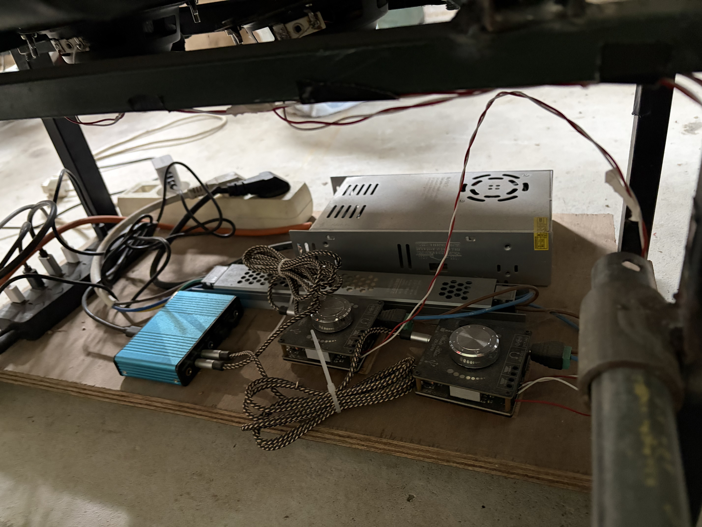

# 🏎️ OpenSource DIY Direct Drive Sim Rig

> **"Ingeniería de competición al alcance del maker."**
> Un ecosistema de simulación completo construido desde cero utilizando piezas de automoción recicladas, impresión 3D avanzada y electrónica de código abierto.

## 📋 Resumen del Proyecto

Este proyecto nació con el objetivo de igualar o superar las sensaciones de los equipos de simulación comerciales de gama alta (>2000€), manteniendo un presupuesto "Low Cost" mediante el diseño propio y la fabricación aditiva.

El núcleo es un sistema **Direct Drive de 15Nm** reales, acompañado de pedales hidráulicos simulados por célula de carga y un sistema de inmersión háptica.

## ⚙️ Especificaciones Técnicas

| Subsistema | Componente | Detalles Técnicos |
| :--- | :--- | :--- |
| **Force Feedback** | Motor DD | Motor Brushless de patinete eléctrico modificado (15Nm Pico) |
| **Control** | Driver | Placa base de impresora 3D con Firmware custom EMC/OSW |
| **Pedales** | Freno | Célula de carga **100kg** + Elastómeros variables |
| **Pedales** | Acelerador | Recorrido ajustable + Potenciómetro lineal |
| **Cambio** | Secuencial | Mecanismo de leva con retorno agresivo por muelle |
| **Handbrake** | Analógico | Célula de carga **20kg** para modulación progresiva |
| **Inmersión** | Bass Shakers | 4x Excitadores acústicos (altavoces mod) + Amplificadores dedicados |

---

## 📸 Galería de Ingeniería

### 1. La Cabina (Driver's Layout)
La ergonomía fue clave en el diseño. Todo está al alcance de la mano. La base del volante cuenta con una carcasa impresa en 3D con ventilación forzada tipo panel de abeja.
Se aprecia la **botonera personalizada** (Button Box) con joystick de navegación y la disposición del cambio secuencial y freno de mano para configuraciones de Rally/Drift.

### 2. Pedales de Célula de Carga (Load Cell)
Diseño personalizado inspirado en la gama alta (Heusinkveld). La estructura combina perfiles de acero con piezas impresas en 3D de alta densidad (relleno 100%).
* **Sensación:** El freno utiliza una célula de carga de 100kg, permitiendo frenar por *presión* muscular y no por recorrido, igual que un coche de carreras real.

### 3. Periféricos de Control
Mecanismos robustos diseñados para aguantar el trato duro.

| Shifter Secuencial | Freno de Mano Hidráulico (Sim) |
| :---: | :---: |
|  |  |
| *Accionamiento metálico* | *Célula de carga visible* |

### 4. El Corazón: Direct Drive & Electrónica
La magia ocurre bajo el capó.
* **Motor:** Se ha adaptado un motor de movilidad eléctrica, diseñando un eje y un acople para el volante, junto con un sistema de **Quick Release impreso en 3D**.
* **Gestión:** Bajo el asiento se encuentra la fuente de alimentación industrial y los controladores de los Bass Shakers, manteniendo el centro de gravedad bajo y el cableado ordenado.

| Motor Unit | Gestión de Cables |
| :---: | :---: |
|  |  |

### 5. Inmersión Háptica (Bass Shakers)
Para sentir los pianos, los cambios de marcha y las revoluciones del motor, se han instalado excitadores acústicos directamente en el chasis (bajo pedales y asiento). Esto añade una capa física de información que el Force Feedback del volante no puede transmitir.

---

## 🛠️ Software y Configuración
* **SimHub:** Controla la matriz LED (RPM, Banderas) y la gestión de los Bass Shakers.
* **Firmware:** Custom Firmware para gestión FFB.

## 🚀 Futuras Mejoras
* [ ] Añadir tercer pedal (Embrague).
* [ ] Mejorar la refrigeración del controlador del motor.
* [ ] Pantalla LCD para telemetría avanzada.

---
*Este es un proyecto DIY. Si te interesa replicar alguna parte, contáctame.*
